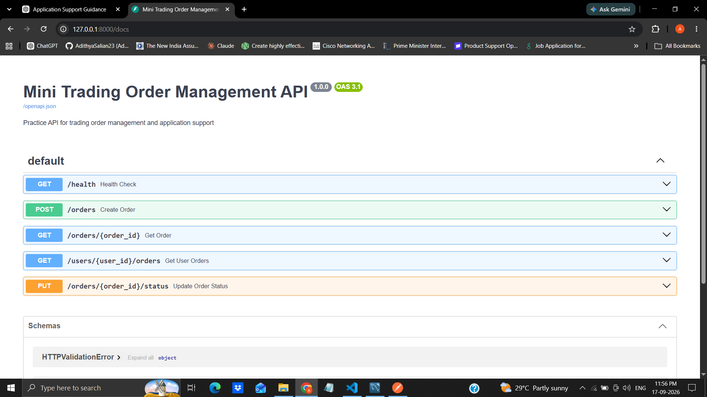
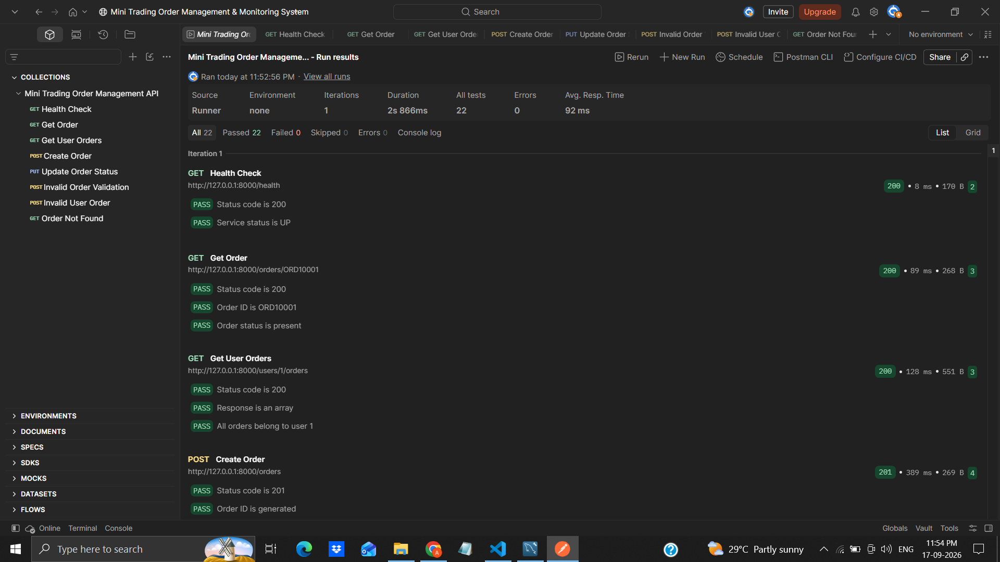
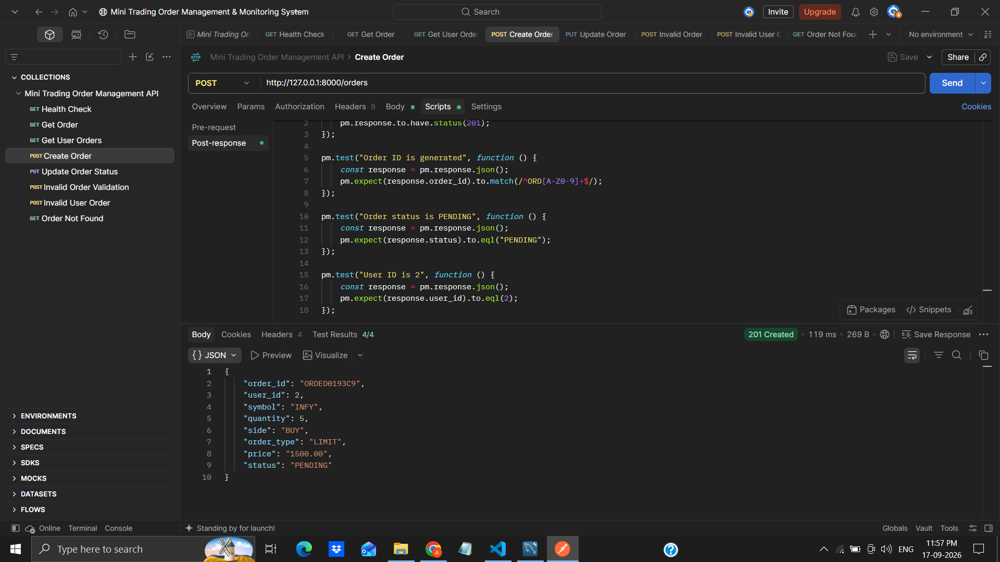
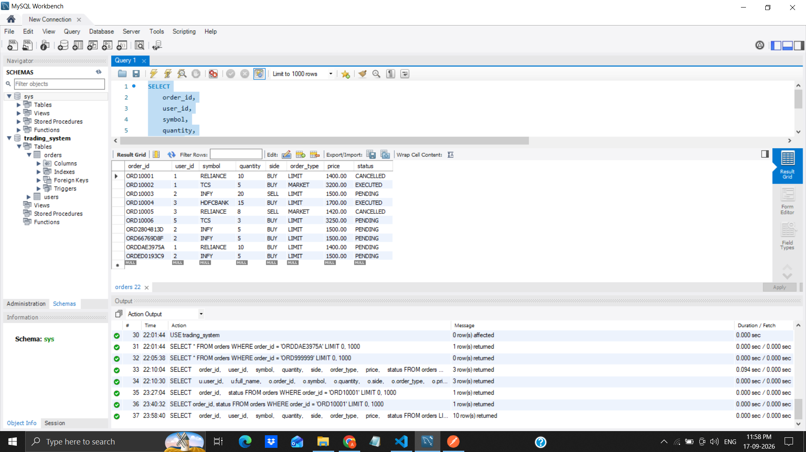
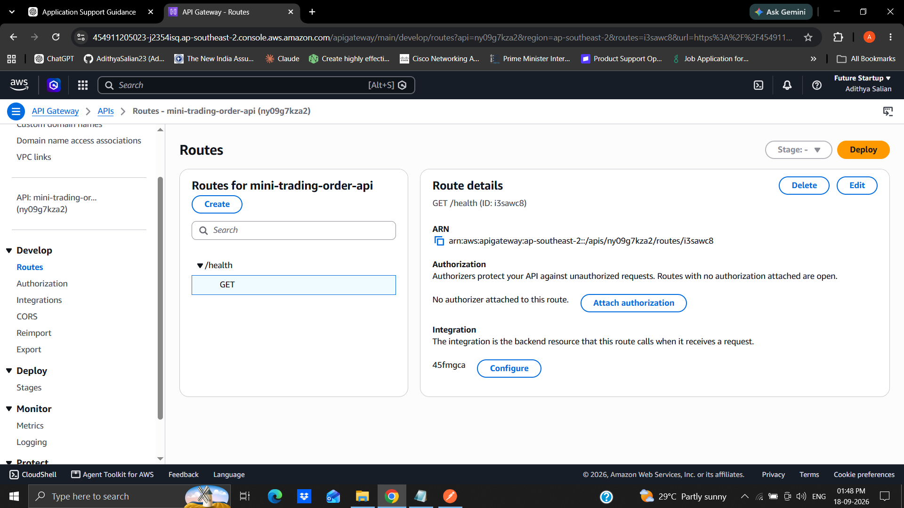
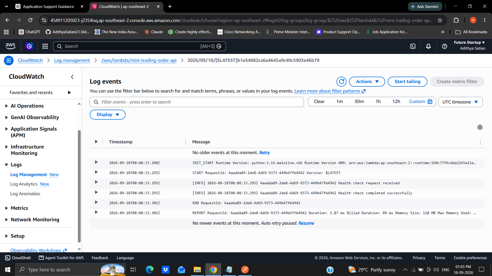

# Mini Trading Order Management & Monitoring System

A Python-based practice project demonstrating REST API development, MySQL database integration, API testing, AWS Lambda, API Gateway, CloudWatch monitoring, and application-support troubleshooting.

> **Note:** This is a learning and demonstration project. It is not a production trading system and does not represent real trading activity or production-scale infrastructure.

---

## 📌 Project Overview

This project simulates a small trading order management application.

The application provides REST APIs for:

- Application health checks
- Creating trading orders
- Retrieving individual orders
- Retrieving orders for a specific user
- Updating order status
- Request validation
- Error handling
- Application logging
- Database interaction
- API testing using Postman
- AWS serverless API execution
- CloudWatch monitoring
- Application-support troubleshooting

The project was developed to gain practical experience with technologies and troubleshooting concepts relevant to **Application Support, Technical Support, API Support, and Software Testing roles**.

---

# 🏗️ System Architecture

## Local Application Architecture

```text
                    ┌─────────────────┐
                    │     Postman     │
                    │   API Testing   │
                    └────────┬────────┘
                             │
                             ▼
                    ┌─────────────────┐
                    │     FastAPI     │
                    │    REST API     │
                    └────────┬────────┘
                             │
                             ▼
                    ┌─────────────────┐
                    │      MySQL      │
                    │    Database     │
                    └─────────────────┘
```

## AWS Architecture

```text
                    ┌─────────────────┐
                    │     Postman     │
                    │   API Testing   │
                    └────────┬────────┘
                             │
                             ▼
                    ┌─────────────────┐
                    │  API Gateway    │
                    │    HTTP API     │
                    └────────┬────────┘
                             │
                             ▼
                    ┌─────────────────┐
                    │  AWS Lambda     │
                    │     Python      │
                    └────────┬────────┘
                             │
                             ▼
                    ┌─────────────────┐
                    │   CloudWatch    │
                    │  Logs & Metrics │
                    └─────────────────┘
```

---

# 🛠️ Technologies Used

## Programming & Backend

- Python
- FastAPI
- SQLAlchemy
- Pydantic
- Uvicorn

## Database

- MySQL
- SQL
- Primary Keys
- Foreign Keys
- Constraints
- JOIN queries

## API Testing

- Postman
- Swagger / OpenAPI
- Automated Postman tests
- Positive testing
- Negative testing

## AWS

- AWS Lambda
- Amazon API Gateway
- Amazon CloudWatch

## Development Tools

- Visual Studio Code
- Git
- GitHub
- draw.io

---

# 🔌 API Endpoints

| Method | Endpoint | Description |
|---|---|---|
| GET | `/health` | Check application health |
| POST | `/orders` | Create a new trading order |
| GET | `/orders/{order_id}` | Retrieve a specific order |
| GET | `/users/{user_id}/orders` | Retrieve all orders for a user |
| PUT | `/orders/{order_id}/status` | Update an order status |

---

# 📋 Order Data

Example order creation request:

```json
{
    "user_id": 2,
    "symbol": "INFY",
    "quantity": 5,
    "side": "BUY",
    "order_type": "LIMIT",
    "price": 1500
}
```

Example response:

```json
{
    "order_id": "ORDXXXXXXXX",
    "user_id": 2,
    "symbol": "INFY",
    "quantity": 5,
    "side": "BUY",
    "order_type": "LIMIT",
    "price": 1500,
    "status": "PENDING"
}
```

The actual `order_id` is generated automatically by the application.

---

# 🗄️ Database Design

The application uses two main database tables.

## Users Table

```text
users
--------------------------------
user_id
full_name
email
account_status
created_at
```

## Orders Table

```text
orders
--------------------------------
order_id
user_id
symbol
quantity
side
order_type
price
status
created_at
updated_at
```

The `orders.user_id` column references `users.user_id` using a foreign key relationship.

### Database Relationships

```text
┌──────────────────┐
│      users       │
├──────────────────┤
│ user_id (PK)     │
│ full_name        │
│ email            │
│ account_status   │
│ created_at       │
└────────┬─────────┘
         │
         │ 1 : Many
         │
         ▼
┌──────────────────┐
│      orders      │
├──────────────────┤
│ order_id (PK)    │
│ user_id (FK)     │
│ symbol           │
│ quantity         │
│ side             │
│ order_type       │
│ price            │
│ status           │
│ created_at       │
│ updated_at       │
└──────────────────┘
```

---

# ✅ API Validation

The API validates incoming requests before processing them.

Validation rules include:

- `user_id` must be greater than zero
- `quantity` must be greater than zero
- `price` must be greater than zero
- `side` must be `BUY` or `SELL`
- `order_type` must be `MARKET` or `LIMIT`
- The requested user must exist in the database

Example invalid request:

```json
{
    "user_id": 2,
    "symbol": "INFY",
    "quantity": -5,
    "side": "BUY",
    "order_type": "LIMIT",
    "price": 1500
}
```

Result:

```text
HTTP 422 Unprocessable Content
```

This demonstrates input validation and controlled error handling.

---

# 🧪 Postman Testing

The project includes a Postman collection containing positive and negative test scenarios.

## Positive Test Scenarios

- Health Check
- Get Order
- Get User Orders
- Create Order
- Update Order Status
- AWS Health Check

## Negative Test Scenarios

- Invalid Order Quantity
- Invalid User
- Non-existent Order

## Automated Testing

Postman scripts were used to automatically verify:

- HTTP status codes
- Response fields
- Generated order IDs
- Order status
- User IDs
- Validation errors
- Error messages
- Response structure

### Test Execution Result

The complete Postman collection was executed successfully:

```text
22 / 22 tests passed
```

---

# ☁️ AWS Implementation

## AWS Lambda

A Python AWS Lambda function was created to provide a serverless health-check implementation.

Example response:

```json
{
    "status": "UP",
    "service": "Trading Order API",
    "environment": "AWS Lambda"
}
```

The Lambda function also generates application logs using Python's logging module.

Example:

```text
Health check request received
Health check completed successfully
```

---

## Amazon API Gateway

An HTTP API was created using Amazon API Gateway.

Current route:

```text
GET /health
```

The route is connected to the Lambda function:

```text
API Gateway
      │
      ▼
AWS Lambda
      │
      ▼
Python application
```

The API Gateway endpoint was tested successfully through Postman and returned:

```text
HTTP 200 OK
```

---

## Amazon CloudWatch

CloudWatch was used to review Lambda execution logs and monitoring metrics.

Example logs:

```text
START RequestId: ...
Health check request received
Health check completed successfully
END RequestId: ...
REPORT RequestId: ...
```

Lambda invocation metrics were also reviewed through the AWS monitoring interface.

---

# 🔎 Application Support & Troubleshooting

The project includes three documented troubleshooting exercises.

The troubleshooting process followed:

```text
Reproduce Issue
      ↓
Investigate
      ↓
Identify Root Cause
      ↓
Apply Resolution
      ↓
Retest
      ↓
Document Incident
```

---

## INC-001 — Order Not Found

### Scenario

A request was made for an order ID that does not exist.

```text
GET /orders/ORD99999
```

### Result

```text
404 Not Found
```

Response:

```json
{
    "detail": "Order not found"
}
```

### Investigation

- Reproduced the issue using Postman
- Checked the `orders` table in MySQL
- Confirmed that the requested order ID did not exist
- Reviewed the API's missing-order handling

### Root Cause

The requested order ID was not present in the database.

### Resolution

No application fix was required because the API correctly handled the invalid request.

Detailed report:

`incident-reports/INC-001-order-not-found.md`

---

# INC-002 — Invalid Order Quantity

### Scenario

An order was submitted with a negative quantity.

```text
quantity = -5
```

### Result

```text
422 Unprocessable Content
```

### Investigation

- Reproduced the issue using Postman
- Reviewed the request payload
- Identified the negative quantity
- Reviewed the API validation rules
- Confirmed that quantity must be greater than zero

### Root Cause

Invalid input data was submitted.

### Resolution

No application fix was required. The API correctly rejected the invalid request through input validation.

Detailed report:

`incident-reports/INC-002-invalid-order-quantity.md`

---

# INC-003 — Database Connection Failure

### Scenario

The database host configuration was temporarily changed to an invalid hostname to simulate a database connectivity failure.

### Result

```text
500 Internal Server Error
```

### Investigation

- Reproduced the failure through the order retrieval endpoint
- Reviewed the application configuration
- Identified an incorrect database host
- Confirmed that the application could not connect to MySQL
- Restored the correct database configuration
- Restarted the FastAPI application
- Retested the endpoint

### Root Cause

An incorrect database host configuration prevented the application from connecting to MySQL.

### Resolution

The database host was restored to:

```text
DB_HOST=localhost
```

The application was restarted and the endpoint was tested again.

### Validation

```text
GET /orders/ORD10001
```

Result:

```text
200 OK
```

Detailed report:

`incident-reports/INC-003-database-connection-failure.md`

---

# 📁 Project Structure

```text
mini-trading-order-management-monitoring/
│
├── app/
│   ├── database.py
│   ├── main.py
│   ├── models.py
│   └── schemas.py
│
├── incident-reports/
│   ├── INC-001-order-not-found.md
│   ├── INC-002-invalid-order-quantity.md
│   └── INC-003-database-connection-failure.md
│
├── screenshots/
│   ├── aws-api-gateway.png
│   ├── aws-cloudwatch-logs.png
│   ├── create-order-response.png
│   ├── mysql-database-results.png
│   ├── postman-test-results.png
│   └── swagger-api-documentation.png
│
├── .gitignore
├── README.md
└── requirements.txt
```

---

# 🚀 How to Run Locally

## 1. Clone the Repository

```bash
git clone https://github.com/AdithyaSalian23/mini-trading-order-management-monitoring.git
```

## 2. Navigate to the Project

```bash
cd mini-trading-order-management-monitoring
```

## 3. Create a Virtual Environment

Windows:

```bash
python -m venv venv
```

Activate it:

```bash
venv\Scripts\activate
```

## 4. Install Dependencies

```bash
pip install -r requirements.txt
```

## 5. Configure MySQL

Create a MySQL database named:

```text
trading_system
```

Create a `.env` file in the project root.

Example:

```text
DB_USER=root
DB_PASSWORD=your_password
DB_HOST=localhost
DB_PORT=3306
DB_NAME=trading_system
```

> **Security:** Do not commit `.env` or database credentials to GitHub. The `.gitignore` file excludes `.env`.

## 6. Start FastAPI

```bash
uvicorn app.main:app --reload
```

## 7. Open Swagger Documentation

```text
http://127.0.0.1:8000/docs
```

---

# 📸 Project Screenshots

## Swagger API Documentation



## Postman Test Results



## Create Order Response



## MySQL Database Results



## AWS API Gateway



## AWS CloudWatch Logs



---

# 🎯 Key Learning Outcomes

This project provided hands-on practice with:

- REST API development using Python and FastAPI
- MySQL database integration
- SQL queries and JOIN operations
- Primary and foreign key relationships
- Database constraints
- API request validation
- HTTP status codes
- Postman API testing
- Automated Postman assertions
- Positive and negative testing
- Python logging
- AWS Lambda
- Amazon API Gateway
- Amazon CloudWatch
- Application monitoring concepts
- API troubleshooting
- Database connectivity troubleshooting
- Root-cause analysis
- Incident documentation
- Git version control
- GitHub repository management

---

# ⚠️ Project Limitations

This is a learning and demonstration project.

It does **not** represent:

- A real trading platform
- Real financial transactions
- Real-time market data
- Production infrastructure
- Production monitoring
- Production incident management
- 40–50k daily users
- High-availability production architecture

The AWS implementation demonstrates basic hands-on experience with **Lambda, API Gateway, and CloudWatch**.

The troubleshooting exercises are simulated incidents created for learning and demonstration purposes.

---

# 👨‍💻 Author

**Adithya Salian**

GitHub:

https://github.com/AdithyaSalian23
